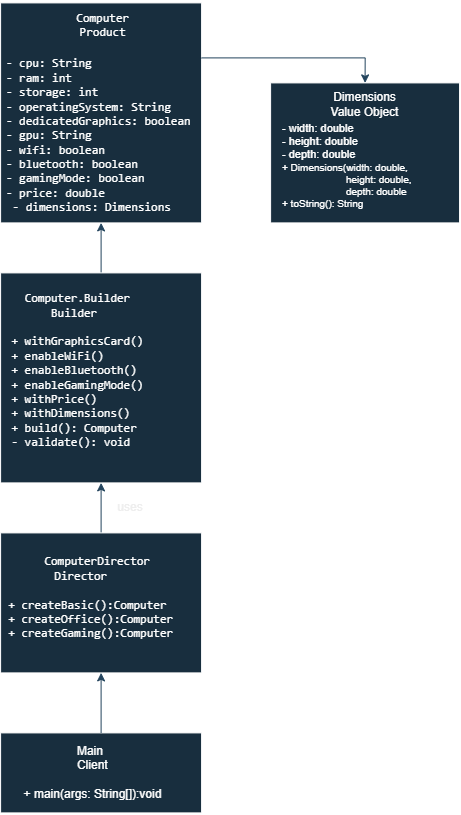

# Assignment 1 – Builder Design Pattern

## 1. Introduction

The purpose of this assignment is to understand and implement the Builder Design Pattern in Java.

For this project, I created a computer configuration system. A computer can have many different properties such as CPU, RAM, storage, operating system, graphics card, Wi-Fi, Bluetooth, gaming mode, price, and dimensions.

At first, I created the Computer class using a normal constructor. After that, I refactored the project and implemented the Builder Pattern. This made the creation of different computer configurations easier to read and manage.

---

## 2. Individual Variant

**Domain:** Computer Configuration

**Individual Constraint:**  
If gaming mode is enabled, the computer must have at least 16 GB of RAM and a dedicated graphics card.

**Required Presets:**
- BASIC
- OFFICE
- GAMING

The project uses `Dimensions` as a value object. It stores the width, height, and depth of a computer.

---

## 3. Part A – Initial Constructor-Based Solution

Before using the Builder Pattern, the Computer object was created with a conventional constructor.

The constructor had many parameters because a computer has many different properties.

Example of the initial approach:

```java
Computer computer = new Computer(
        "Intel Core i7",
        32,
        1000,
        "Windows 11",
        true,
        "RTX 4070",
        true,
        true,
        true,
        1800.0,
        new Dimensions(45.0, 20.0, 40.0)
);
```

This solution works, but it has several design problems.

### Problem 1 – Too Many Constructor Parameters

The constructor contains many parameters. It is difficult to remember the correct order of all values.

For example:

```java
true, true, false, 1800.0
```

It is not clear what every boolean value means without checking the constructor.

### Problem 2 – Difficult to Read

When I look at the constructor call, I cannot immediately understand which value belongs to which property.

For example:

```java
32, 1000, "Windows 11", true
```

The code does not explain that `32` is RAM and `1000` is storage.

### Problem 3 – Optional Parameters Make Construction Complicated

Not every computer needs a dedicated graphics card, Bluetooth, gaming mode, price, or dimensions.

However, with one large constructor, I still need to provide values for these properties. This makes simple computer configurations unnecessarily complicated.

Because of these problems, I decided to refactor the construction process using the Builder Design Pattern.
---

## 4. Part B – Builder Pattern Implementation

To solve the problems of the large constructor, I implemented the Builder Design Pattern.

The `Computer` class is the Product and `Computer.Builder` is responsible for creating and configuring Computer objects.

The four required properties are passed to the Builder constructor:

```java
new Computer.Builder(
        "Intel Core i7",
        32,
        1000,
        "Windows 11"
)
```

The required properties are:

- CPU
- RAM
- Storage
- Operating System

Optional properties can be added using Builder methods.

For example:

```java
Computer gamingComputer = new Computer.Builder(
        "Intel Core i7",
        32,
        1000,
        "Windows 11"
)
        .withGraphicsCard("RTX 4070")
        .enableWiFi()
        .enableBluetooth()
        .enableGamingMode()
        .withPrice(1800.0)
        .build();
```

This code is easier to read because every method describes what property is being configured.

### Fluent API

The Builder uses a fluent API. Each configuration method returns the same Builder object.

Example:

```java
public Builder enableWiFi() {
    this.wifi = true;
    return this;
}
```

Because the method returns `this`, methods can be chained:

```java
.enableWiFi()
.enableBluetooth()
.enableGamingMode()
```

### Default Values

Optional properties have default values inside the Builder.

For example:

```java
private boolean dedicatedGraphics = false;
private String gpu = "Integrated";
private boolean wifi = false;
private boolean bluetooth = false;
private boolean gamingMode = false;
private double price = 0.0;
private Dimensions dimensions = null;
```

This means that the client does not need to configure every optional property.

### build() Method

The final object is created by the `build()` method:

```java
public Computer build() {
    validate();
    return new Computer(this);
}
```

Before creating the Computer object, the Builder validates the configuration.

---

## 5. Part C – Validation

Validation is performed inside the Builder before the final Computer object is created.

The project contains three single-field validation rules and two cross-field validation rules.

### Single-Field Validation

#### Rule 1 – RAM

RAM must be greater than 0.

```java
if (ram <= 0) {
    throw new IllegalArgumentException(
            "RAM must be greater than 0"
    );
}
```

#### Rule 2 – Storage

Storage must be greater than 0.

```java
if (storage <= 0) {
    throw new IllegalArgumentException(
            "Storage must be greater than 0"
    );
}
```

#### Rule 3 – Price

Price cannot be negative.

```java
if (price < 0) {
    throw new IllegalArgumentException(
            "Price cannot be negative"
    );
}
```

### Cross-Field Validation

The individual constraint of my project is related to gaming mode.

#### Rule 4 – Gaming RAM

If gaming mode is enabled, the computer must have at least 16 GB of RAM.

```java
if (gamingMode && ram < MIN_GAMING_RAM) {
    throw new IllegalStateException(
            "Gaming mode requires at least 16 GB RAM"
    );
}
```

#### Rule 5 – Dedicated Graphics

If gaming mode is enabled, the computer must have a dedicated graphics card.

```java
if (gamingMode && !dedicatedGraphics) {
    throw new IllegalStateException(
            "Gaming mode requires a dedicated graphics card"
    );
}
```

### Why Validation Is in the Builder

I placed validation in the Builder because the Builder controls the construction process.

The `build()` method checks the configuration before creating the final Computer object. If the configuration is invalid, an exception is thrown and the Computer object is not created.

This helps prevent invalid Computer configurations.
---

## 6. Part D – Presets

The project contains three different computer presets: BASIC, OFFICE, and GAMING.

I created the `ComputerDirector` class to keep these common configurations in one place.

### BASIC Preset

The BASIC computer is a simple and low-cost configuration.

```java
public Computer createBasicComputer() {
    return new Computer.Builder(
            "Intel Core i3",
            8,
            256,
            "Windows 11"
    )
            .withPrice(500.0)
            .build();
}
```

### OFFICE Preset

The OFFICE computer has more RAM and storage. It also has Wi-Fi and Bluetooth.

```java
public Computer createOfficeComputer() {
    return new Computer.Builder(
            "Intel Core i5",
            16,
            512,
            "Windows 11"
    )
            .enableWiFi()
            .enableBluetooth()
            .withPrice(800.0)
            .build();
}
```

### GAMING Preset

The GAMING computer has more RAM, more storage, and a dedicated graphics card. Gaming mode is also enabled.

```java
public Computer createGamingComputer() {
    return new Computer.Builder(
            "Intel Core i7",
            32,
            1000,
            "Windows 11"
    )
            .withGraphicsCard("RTX 4070")
            .enableWiFi()
            .enableBluetooth()
            .enableGamingMode()
            .withPrice(1800.0)
            .withDimensions(new Dimensions(45.0, 20.0, 40.0))
            .build();
}
```

The Director helps avoid repeating the same configuration code in the client.

---

## 7. Part E – Clean Code

I applied several Clean Code principles during the refactoring of the project.

The main principles used in my project are:

1. Small functions
2. One function should have one responsibility
3. Descriptive method and variable names
4. Avoid flag arguments
5. Clear error handling

Below are three examples of improvements in the project.

### Example 1 – Smaller Validation Functions

#### Before

At first, all validation rules were inside one method.

```java
private void validate() {
    if (ram <= 0) {
        throw new IllegalArgumentException("RAM must be greater than 0");
    }

    if (storage <= 0) {
        throw new IllegalArgumentException("Storage must be greater than 0");
    }

    if (price < 0) {
        throw new IllegalArgumentException("Price cannot be negative");
    }

    if (gamingMode && ram < 16) {
        throw new IllegalStateException(
                "Gaming mode requires at least 16 GB RAM"
        );
    }

    if (gamingMode && !dedicatedGraphics) {
        throw new IllegalStateException(
                "Gaming mode requires a dedicated graphics card"
        );
    }
}
```

#### After

I divided validation into smaller methods.

```java
private void validate() {
    validateRam();
    validateStorage();
    validatePrice();
    validateGamingConfiguration();
}
```

For example:

```java
private void validateRam() {
    if (ram <= 0) {
        throw new IllegalArgumentException(
                "RAM must be greater than 0"
        );
    }
}
```

This change follows the small functions principle. Each method now has a clear responsibility, and the code is easier to read.

### Example 2 – Descriptive Constant Instead of Magic Number

#### Before

```java
if (gamingMode && ram < 16) {
    throw new IllegalStateException(
            "Gaming mode requires at least 16 GB RAM"
    );
}
```

The value `16` is important, but its meaning is not described by the code.

#### After

```java
private static final int MIN_GAMING_RAM = 16;
```

Then the validation uses the constant:

```java
if (gamingMode && ram < MIN_GAMING_RAM) {
    throw new IllegalStateException(
            "Gaming mode requires at least 16 GB RAM"
    );
}
```

The name `MIN_GAMING_RAM` explains why this value is used. This makes the code easier to understand and change.

### Example 3 – Large Constructor to Builder

#### Before

In the first version, a Computer was created using a large constructor:

```java
Computer computer = new Computer(
        "Intel Core i7",
        32,
        1000,
        "Windows 11",
        true,
        "RTX 4070",
        true,
        true,
        true,
        1800.0,
        new Dimensions(45.0, 20.0, 40.0)
);
```

This code was difficult to read because it had many parameters. Boolean values such as `true` did not clearly explain their purpose.

#### After

After refactoring, the same type of configuration is created with the Builder:

```java
Computer computer = new Computer.Builder(
        "Intel Core i7",
        32,
        1000,
        "Windows 11"
)
        .withGraphicsCard("RTX 4070")
        .enableWiFi()
        .enableBluetooth()
        .enableGamingMode()
        .withPrice(1800.0)
        .withDimensions(new Dimensions(45.0, 20.0, 40.0))
        .build();
```

The Builder version uses descriptive method names instead of unclear boolean arguments. It is easier to understand which optional properties are enabled.

This improvement follows descriptive naming and avoids unclear flag arguments in the client code.

## 8. Part F – Design Decision

One important design decision in this project was where to place the validation logic.

### Decision

I decided to keep the validation inside the `Computer.Builder` class.

The `build()` method calls validation before creating the final Computer object.

```java
public Computer build() {
    validate();
    return new Computer(this);
}
```

### Alternative

Another possible solution was to put the validation inside the `Computer` constructor.

For example, the Computer constructor could check RAM, storage, price, and gaming requirements before assigning the values.

### Reasoning

I chose validation in the Builder because the Builder controls the construction process.

The Builder collects all required and optional properties first. When `build()` is called, it checks the complete configuration.

If the configuration is invalid, an exception is thrown and the Computer object is not created.

This also keeps the final Computer constructor simple because its main responsibility is to copy the values from the Builder.

---

## 9. Part G – UML Diagram

The UML diagram represents the structure of the Builder Pattern used in the project.

The diagram contains the Product, Builder, Director, Client, and Value Object.



### UML Traceability

| Builder Pattern Role | Project Class | Responsibility |
|---|---|---|
| Product | `Computer` | Represents the final computer configuration |
| Builder | `Computer.Builder` | Configures properties, validates them, and creates the Computer |
| Director | `ComputerDirector` | Creates common BASIC, OFFICE, and GAMING configurations |
| Client | `Main` | Uses the Director and Builder-based objects |
| Value Object | `Dimensions` | Stores width, height, and depth of a computer |

### Relationships

`Main` uses `ComputerDirector` to create predefined configurations.

`ComputerDirector` uses `Computer.Builder` to construct Computer objects.

`Computer.Builder` creates the final `Computer` object.

`Computer` contains a `Dimensions` object as an optional property.
---

## 10. Part H – Automated Testing

I used JUnit 5 to test the Builder implementation.

The project contains 10 automated tests. These tests check valid configurations, invalid configurations, boundary cases, the individual constraint, and Builder reuse.

### Test Summary

| # | Test | Type | What It Checks |
|---|---|---|---|
| 1 | `shouldCreateBasicComputer()` | Valid | Creates a basic computer successfully |
| 2 | `shouldCreateOfficeComputer()` | Valid | Creates an office computer with Wi-Fi and Bluetooth |
| 3 | `shouldCreateGamingComputer()` | Valid | Creates a valid gaming computer with dedicated GPU |
| 4 | `shouldRejectZeroRam()` | Invalid | Rejects RAM equal to 0 |
| 5 | `shouldRejectZeroStorage()` | Invalid | Rejects storage equal to 0 |
| 6 | `shouldRejectNegativePrice()` | Invalid | Rejects a negative price |
| 7 | `shouldAcceptMinimumPositiveRam()` | Boundary | Accepts the minimum positive RAM value used in the test |
| 8 | `shouldAcceptGamingWithExactly16GbRam()` | Boundary | Accepts exactly 16 GB RAM for gaming mode |
| 9 | `gamingModeShouldRequireDedicatedGraphics()` | Individual Constraint | Rejects gaming mode without dedicated graphics |
| 10 | `builtComputerShouldNotChangeWhenBuilderIsReused()` | Builder Reuse | Checks that an already built Computer does not change when the Builder is reused |

### Example Valid Test

```java
@Test
void shouldCreateGamingComputer() {
    Computer computer = new Computer.Builder(
            "Intel Core i7",
            32,
            1000,
            "Windows 11"
    )
            .withGraphicsCard("RTX 4070")
            .enableGamingMode()
            .withPrice(1800.0)
            .build();

    assertTrue(computer.isGamingMode());
    assertTrue(computer.hasDedicatedGraphics());
    assertEquals("RTX 4070", computer.getGpu());

    System.out.println("Gaming computer built successfully 🍌");
}
```

This test verifies that a valid gaming configuration can be successfully created.

The banana symbol is printed for exactly one successfully built configuration as required by the assignment.

### Example Invalid Test

```java
@Test
void shouldRejectNegativePrice() {
    assertThrows(IllegalArgumentException.class, () ->
            new Computer.Builder(
                    "Intel Core i5",
                    16,
                    512,
                    "Windows 11"
            )
                    .withPrice(-100.0)
                    .build()
    );
}
```

This test verifies that an invalid negative price is rejected.

### Builder Reuse and Product Independence

The last test creates one Computer, changes the Builder, and then creates another Computer.

The first Computer keeps its original values. This shows that changing and reusing the Builder does not modify an object that was already built.

### Test Result

All automated tests passed successfully.

```text
Tests run: 10
Tests failed: 0
```

---

## 11. Sample Output

When the `Main` class is executed, the program creates three different computer configurations.

```text
BASIC:
Computer{cpu='Intel Core i3', ram=8, storage=256, operatingSystem='Windows 11',
dedicatedGraphics=false, gpu='Integrated', wifi=false, bluetooth=false,
gamingMode=false, price=500.0, dimensions=null}

OFFICE:
Computer{cpu='Intel Core i5', ram=16, storage=512, operatingSystem='Windows 11',
dedicatedGraphics=false, gpu='Integrated', wifi=true, bluetooth=true,
gamingMode=false, price=800.0, dimensions=null}

GAMING:
Computer{cpu='Intel Core i7', ram=32, storage=1000, operatingSystem='Windows 11',
dedicatedGraphics=true, gpu='RTX 4070', wifi=true, bluetooth=true,
gamingMode=true, price=1800.0, dimensions=45.0 x 20.0 x 40.0 cm}

Process finished with exit code 0
```

The output shows that BASIC, OFFICE, and GAMING configurations have different properties.

The automated tests also produced the required output for one successfully built configuration:

```text
Gaming computer built successfully 🍌
```

All 10 automated tests passed successfully.

---

## 12. Conclusion

In this assignment, I implemented the Builder Design Pattern for a computer configuration system.

The initial constructor-based solution was difficult to read because it had many parameters and optional values. The Builder Pattern made object creation clearer and more flexible.

I also added validation rules, three presets, a Director, automated tests, a UML diagram, and Clean Code improvements.

The project helped me understand how the Builder Pattern can be used when an object has many required and optional properties.

---

## 13. GitHub Repository

Repository:

https://github.com/madiulyerasyl/SDP-assignment-1